Apache Hadoop adalah sebuah framework perangkat lunak sumber terbuka untuk penyimpanan dan pemrosesan data besar (big
data) dalam lingkungan terdistribusi. Hadoop dirancang untuk mengatasi tantangan yang muncul dari volume, variasi, dan
kecepatan data yang sangat besar dengan memecah pekerjaan besar menjadi potongan-potongan kecil dan menyebarkannya ke
beberapa mesin untuk pemrosesan paralel.

Beberapa kunci utama kenapa Hadoop menjadi populer adalah:

- **Hadoop Distributed File System (HDFS)**: Sistem file terdistribusi yang dirancang untuk menyimpan data besar di
  seluruh cluster mesin.

- **MapReduce**: Model pemrograman untuk memproses data besar secara paralel, dengan membagi pekerjaan menjadi dua tahap
  yaitu map dan reduce.

- **YARN (Yet Another Resource Negotiator)**: Pengelola sumber daya yang memungkinkan penjadwalan aplikasi dan
  pengelolaan sumber daya cluster secara efisien.

- **Ekosistem Hadoop**: Sejumlah proyek terkait yang memperluas fungsionalitas Hadoop, seperti Apache Hive, Apache Pig,
  Apache Spark, dan lainnya.

Dalam tutorial ini, kita akan belajar cara menginstal dan mengkonfigurasi Apache Hadoop. Penulis akan menggunakan Apache
Hadoop versi 3.4.0. Penulis juga akan memberikan skrip shell otomatis untuk memudahkan proses instalasi dan konfigurasi.

# Persyaratan

Sebelum kita mulai, pastikan Anda telah memenuhi persyaratan berikut:

- Pemahaman dasar tentang operasi sistem Linux.
- Sistem operasi Linux (Ubuntu, CentOS, atau distribusi Linux lainnya).
- Ruang penyimpanan yang cukup untuk menginstal Hadoop (minimal 10 GB).
- Koneksi internet untuk mengunduh paket Hadoop.

# Langkah 1: Menjalankan Skrip Instalasi
Lakukan perintah berikut untuk menjalankan skrip instalasi:

```bash
curl https://gist.githubusercontent.com/elskow/dc000726916b87a0bd38ba1c522a68a5/raw/3a5d1057d5ef0978c13a6e93d306523d098c543c/hadoop-single-node-provision.sh | bash
```

Skrip ini akan meminta Anda untuk memasukkan akses _sudo_ untuk menginstal paket yang diperlukan. Pastikan untuk
memasukkan _password_ pengguna _sudo_ saat diminta.

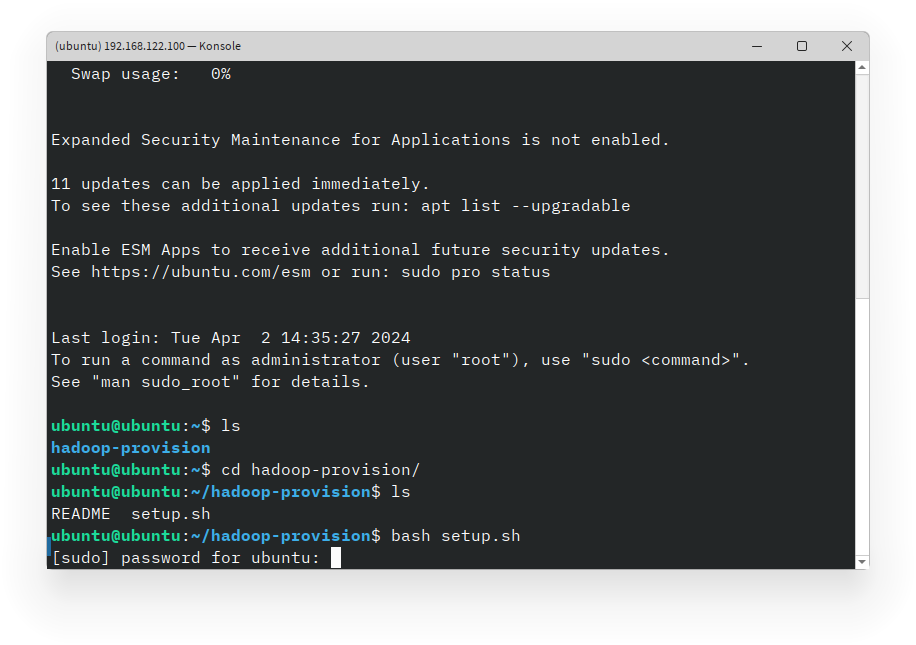

Proses update dan upgrade paket akan dimulai. Tunggu hingga proses selesai sebelum melanjutkan. Kemudian akan dimint
untuk melakukan konfirmasi restart service. Tak perlu khawatir, anda hanya perlu menekan tombol `Tab` dan
kemudian `Enter` untuk melanjutkan.

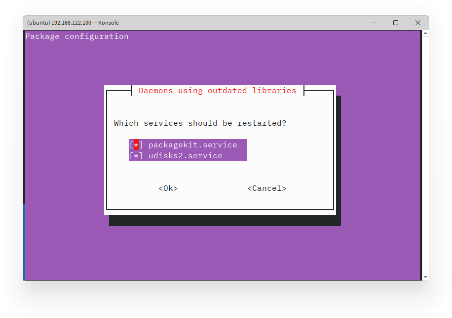

Setelah proses selesai, Hadoop akan di-inisiasi dengan user baru. Anda dapat menentukan password, identitas user. Anda
dapat membuat user tanpa identitas dengan menekan tombol `Enter`, namun password tetap harus diisi. Kemudian konfirmasi
password yang telah diinput dengan menekan tombol `y` lalu `Enter`.
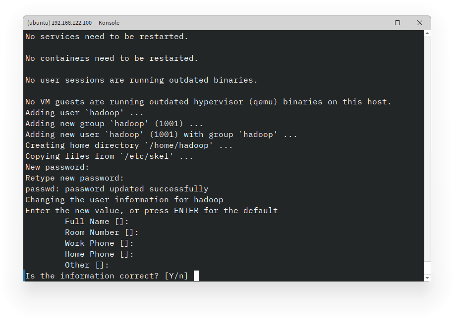

Kemudian, proses instalasi dan konfigurasi Hadoop akan dimulai. Tunggu hingga proses selesai sebelum melanjutkan.

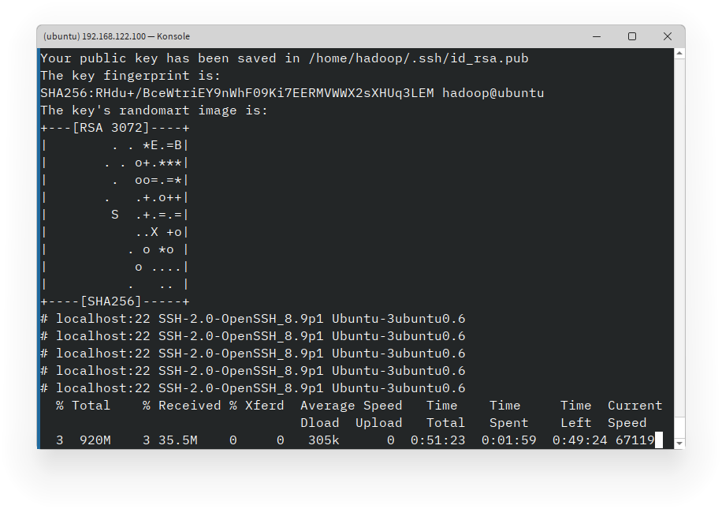

Setelah proses selesai, Anda akan melihat pesan bahwa instalasi dan konfigurasi Hadoop telah selesai.

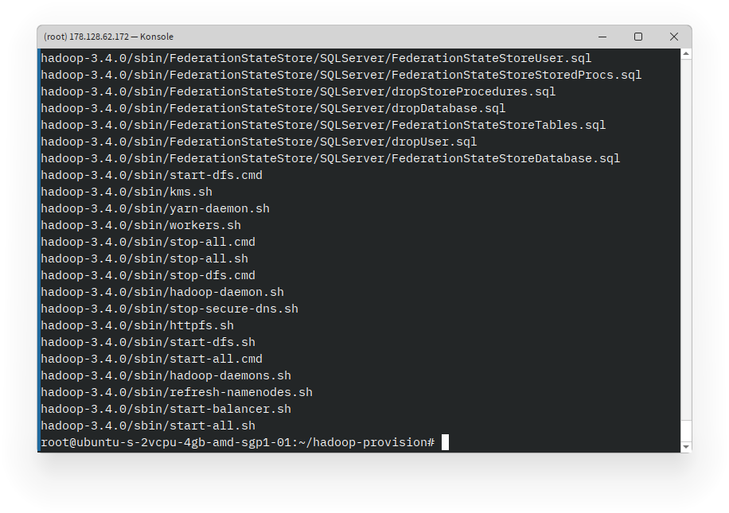

Anda dapat beralih ke user `hadoop` dengan perintah untuk menjalankan perintah Hadoop.

```bash
su - hadoop
```

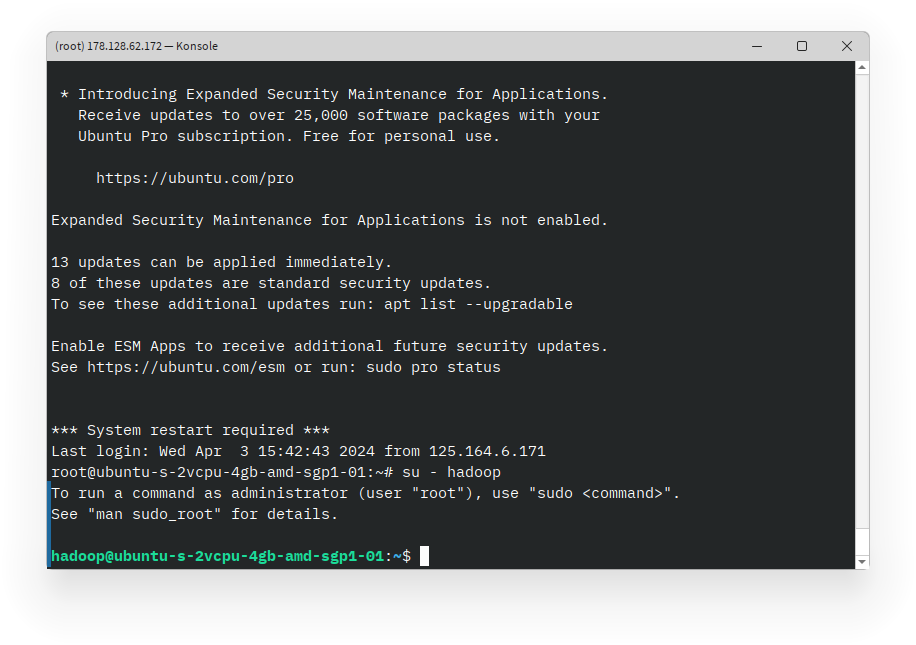

# Langkah 2: Menjalankan Hadoop

Setelah instalasi selesai, Anda perlu untuk memformat HDFS sebelum menjalankan Hadoop. Anda dapat melakukannya dengan
perintah berikut:

```bash
hdfs namenode -format
```

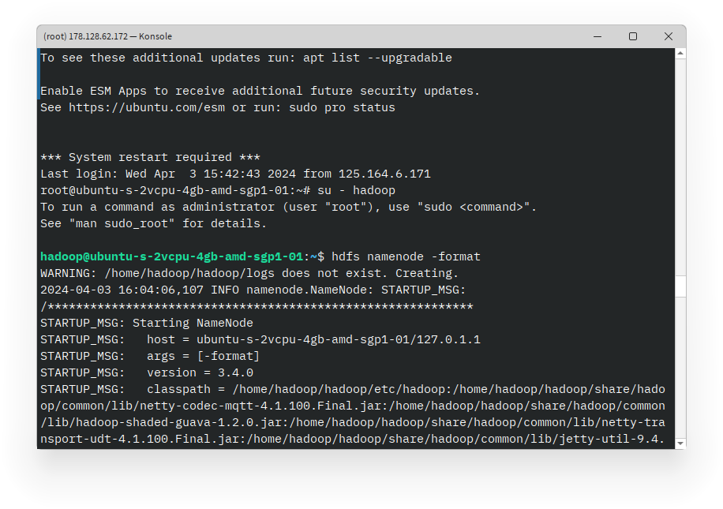

Setelah HDFS diformat, Anda dapat memulai Hadoop dengan perintah berikut:

```bash
start-all.sh
```

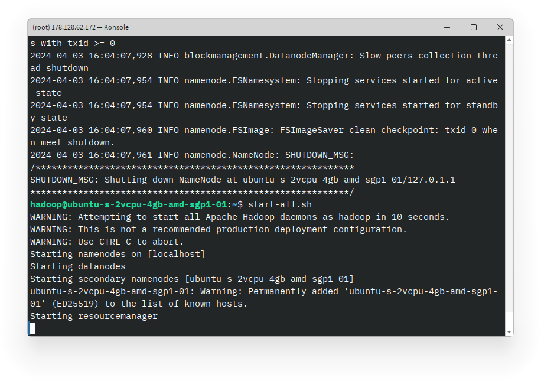

Perintah ini akan memulai semua layanan Hadoop, termasuk HDFS, YARN, dan tampilan web Hadoop. Anda dapat mengakses
tampilan web Hadoop dengan membuka `http://{ip_address}:9870` di browser Anda.

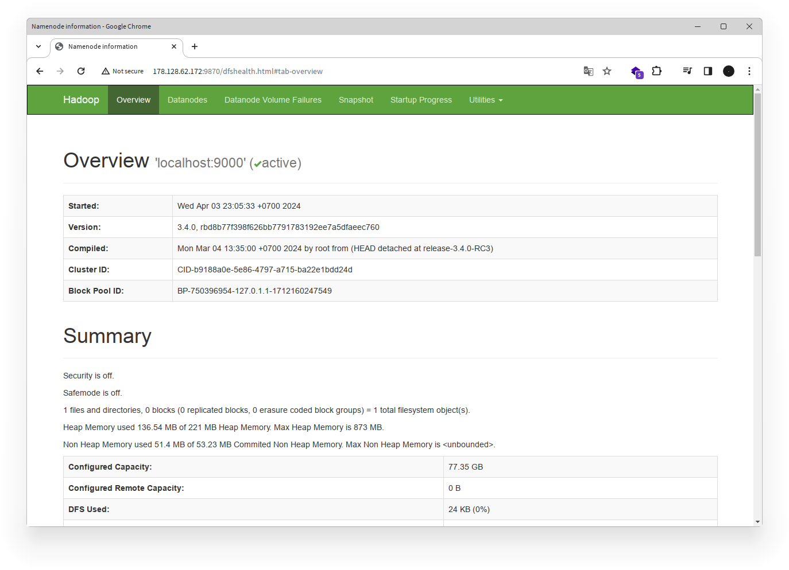

**Catatan**:

- Ganti `{ip_address}` dengan alamat IP mesin atau `localhost` jika Anda menjalankan Hadoop pada mesin lokal.
- Untuk mengetahui alamat IP mesin, Anda dapat menggunakan perintah `ifconfig` atau `ip a`.

Anda sekarang telah berhasil menginstal dan menjalankan Apache Hadoop. Anda dapat mulai menggunakan Hadoop untuk
memproses data besar dan menjalankan aplikasi yang memanfaatkan ekosistem Hadoop.

# Mencoba Penggunaan Hadoop : WordCount

Untuk mencoba penggunaan Hadoop, kita akan menggunakan contoh program WordCount yang merupakan program klasik dalam
pemrograman MapReduce. Program ini akan menghitung jumlah kemunculan setiap kata dalam sebuah file teks.

## Langkah 1: Buatlah Folder User

Pertama, kita akan membuat folder user di HDFS untuk menyimpan file input dan output program WordCount. Disini kita akan
menggunakan tampilan web Hadoop untuk membuat folder.

1. Buka tampilan web Hadoop di `http://{ip_address}:9870`.
2. Klik pada tab **Utilities** di bagian atas halaman.
3. Pilih **Browse the file system**.
   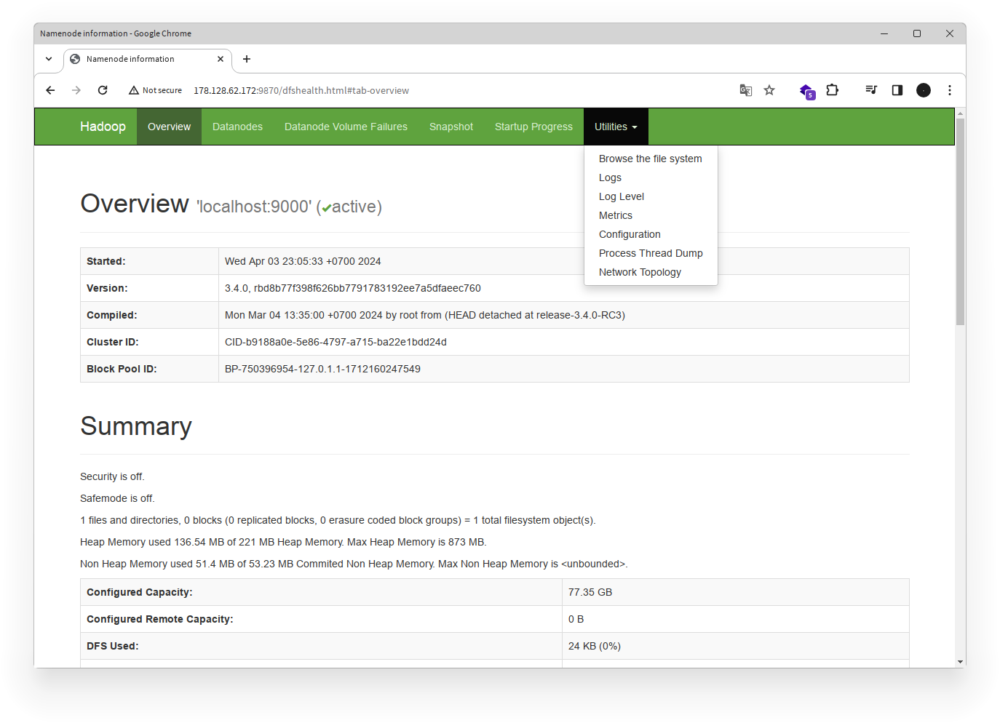
4. Untuk membuat folder baru, klik icon **Create** di samping tombol **Go**.
   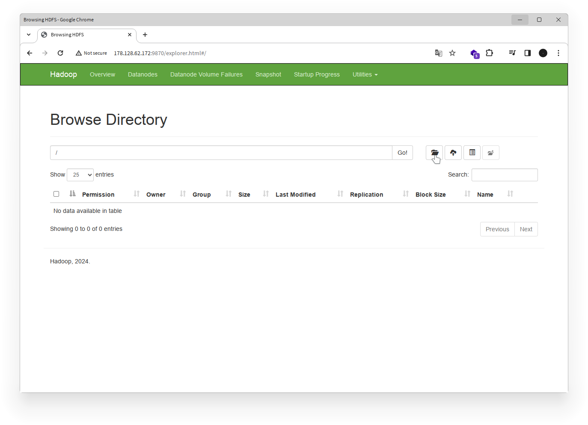
5. Masukkan nama folder bernama `user` dan klik **Create**.
   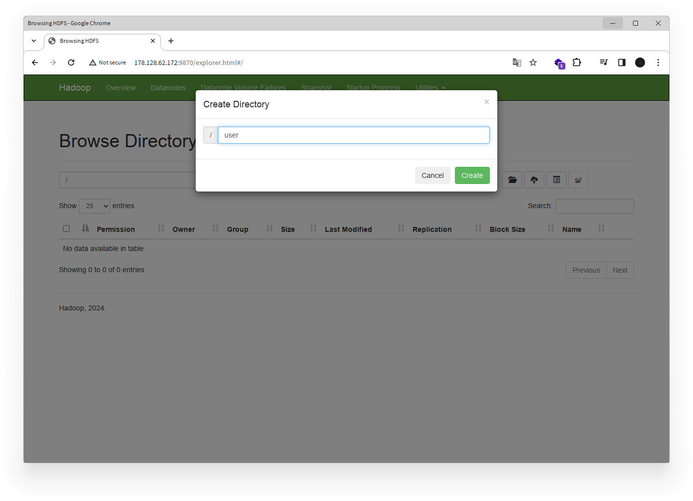
6. Klik folder `user` yang baru dibuat.
7. Klik icon **Create** untuk membuat folder baru di dalam folder `user`.
8. Masukkan nama folder baru bernama `hadoop` dan klik **Create**.

## Langkah 2: Menyiapkan File Input

Untuk menguji program WordCount, kita akan menggunakan file teks sederhana sebagai input. Anda dapat membuat file teks
dengan teks acak atau menggunakan file contoh yang disediakan. Disini kita akan menggunakan file contoh dari Kaggle yang
berisi teks dari novel "Alice's Adventures in Wonderland" oleh Lewis Carroll. File ini dapat diunduh
dari [tautan berikut](https://www.kaggle.com/datasets/roblexnana/alice-wonderland-dataset).

1. Unduh file `alice_in_wonderland.txt` di komputer lokal Anda.
2. Unggah file `alice_in_wonderland.txt` ke folder `user/hadoop` di HDFS menggunakan tampilan web Hadoop.
   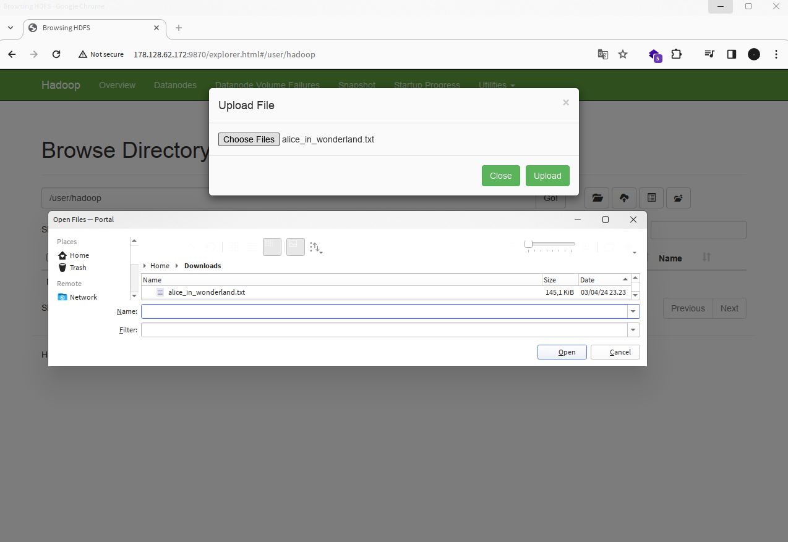

## Langkah 3: Menjalankan Program WordCount

Setelah file input disiapkan, kita akan menjalankan program WordCount menggunakan Hadoop. Program WordCount terdiri dari
dua bagian yaitu _mapper_ dan _reducer_ yang akan dijalankan oleh Hadoop.

1. Buka terminal dan beralih ke user `hadoop`.
2. Jalankan perintah WordCount dengan perintah berikut:

```bash
hadoop jar $HADOOP_HOME/share/hadoop/mapreduce/hadoop-mapreduce-examples-3.4.0.jar wordcount alice_in_wonderland.txt output
```

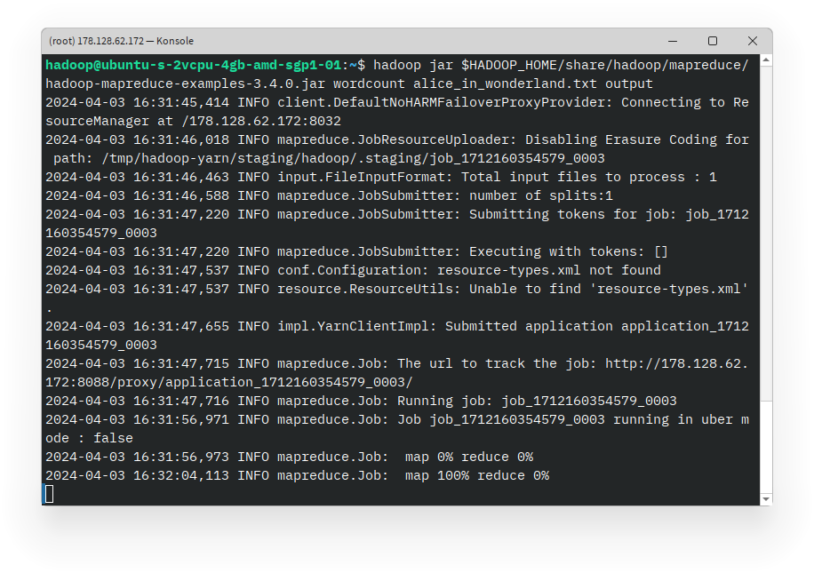
Perintah ini akan menjalankan program WordCount pada file `alice_in_wonderland.txt` dan menyimpan hasilnya di
folder `user/hadoop/output` di HDFS.

## Langkah 4: Melihat Hasil WordCount

Setelah program WordCount selesai dijalankan, Anda dapat melihat hasilnya di folder `user/hadoop/output` di HDFS
menggunakan tampilan web Hadoop.

1. Buka tampilan web Hadoop di `http://{ip_address}:9870`.
2. Klik pada tab **Utilities** di bagian atas halaman.
3. Pilih **Browse the file system**.
4. Klik folder `user` -> `hadoop` -> `output` untuk melihat hasil WordCount.
   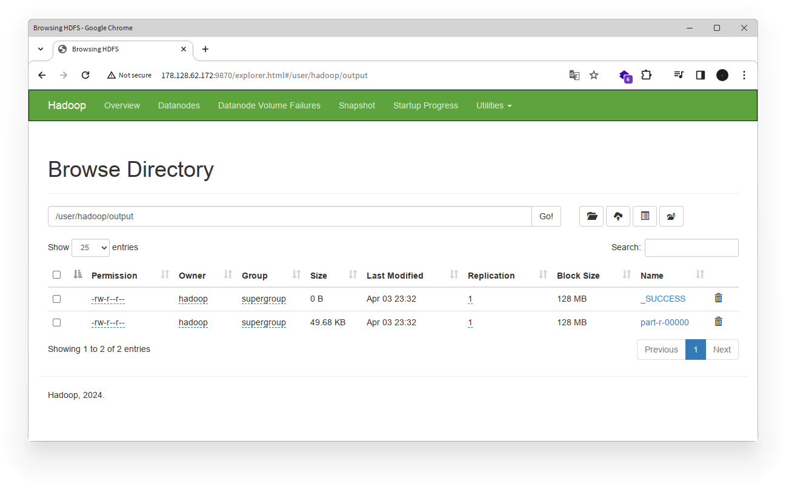
5. Klik pada file `part-r-00000` untuk melihat hasil WordCount. Anda dapat mengunduh file ini untuk melihat hasil secara
   lebih detail, atau melihatnya langsung di tampilan web.
   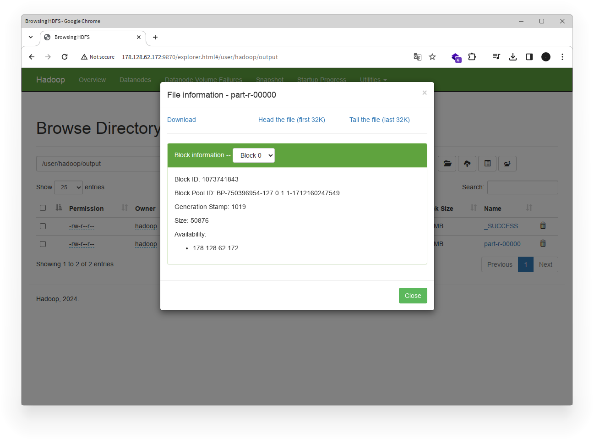

Anda telah berhasil menjalankan program WordCount menggunakan Hadoop dan melihat hasilnya. Program WordCount adalah
contoh sederhana dari penggunaan Hadoop untuk memproses data besar menggunakan pemrograman MapReduce.

# Penutup

Dalam tutorial ini, Anda telah belajar cara menginstal dan mengkonfigurasi Apache Hadoop menggunakan skrip shell
otomatis. Anda juga telah mencoba menjalankan program WordCount menggunakan Hadoop untuk memproses data besar. Dengan
Apache Hadoop, Anda dapat memproses, menganalisis, dan mengelola data besar dengan mudah dan efisien. Selamat mencoba!

# Referensi

- [Apache Hadoop](https://hadoop.apache.org/)
- [Hadoop Single Node Cluster Setup](https://hadoop.apache.org/docs/stable/hadoop-project-dist/hadoop-common/SingleCluster.html)