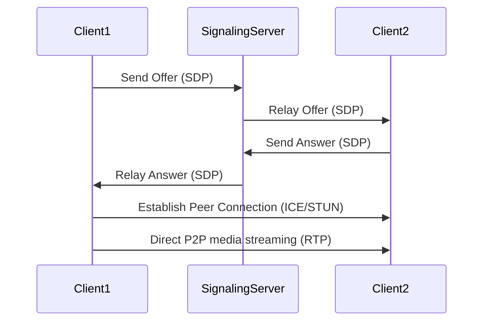
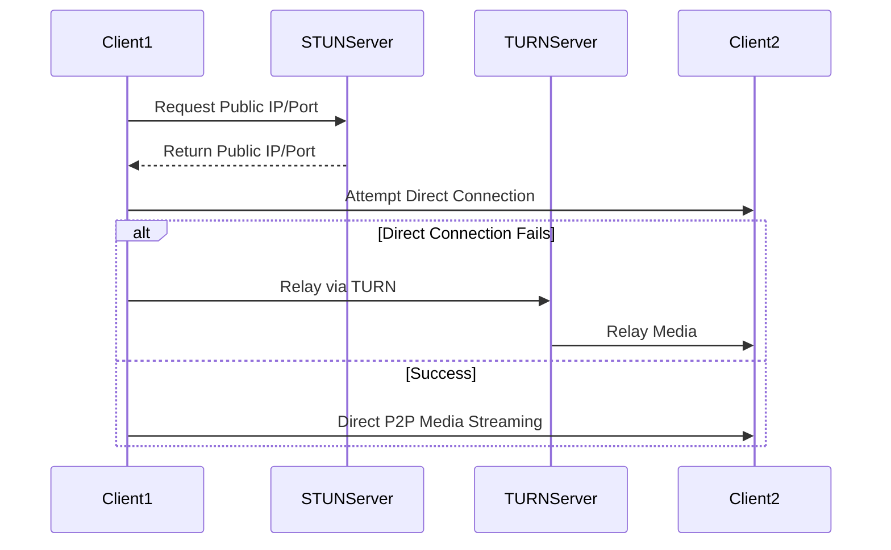
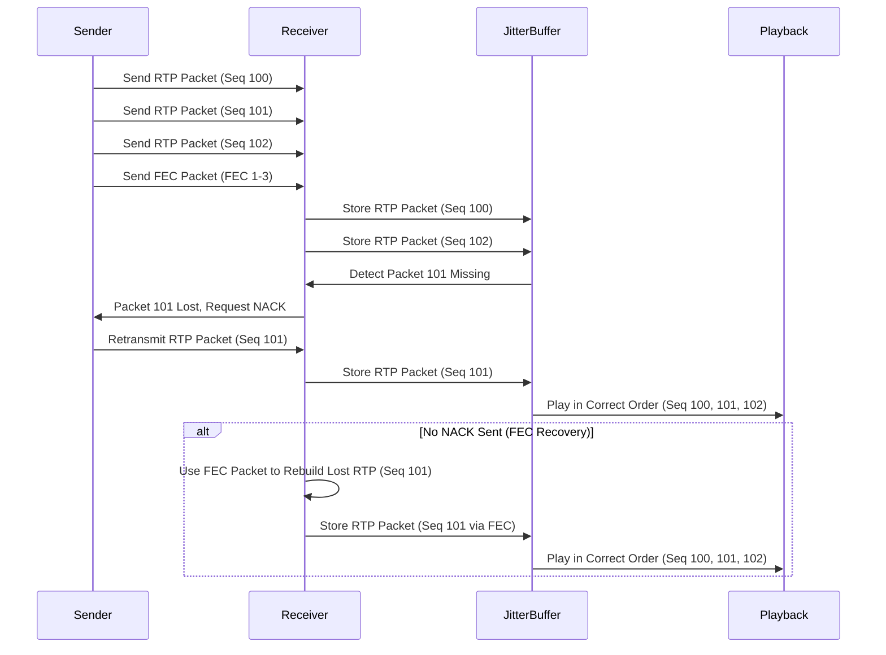

Building a video chat feature sounds like something you’d do over a weekend, right? Throw some **WebRTC**, sprinkle a little **WebSocket**, and voila—instant video conferencing! _Well, if only it were that simple_.

<figure>
    
    <figcaption>Photo by Shvets Anna from Pexels</figcaption>
</figure>

What I discovered during my attempt to craft a smooth, real-time video chat solution is this: building the actual communication platform is like trying to herd a bunch of digital cats. The real **challenge**? _The network_.

And it’s not just the network – the choice of _codecs_ plays a huge role in delivering high-quality audio and video, and ensuring it doesn’t sound like a robot got stuck in a loop.

# Understanding the Big Picture: Why Network is King

The key to a smooth video chat experience is not just **WebRTC** or some fancy UI—it’s how the network infrastructure handles the connection between peers. When you’ve got two (or more) clients trying to have a conversation, they need to find each other, navigate complex network environments, and send video and audio packets with as little delay as possible.

---

# Discovery 1: The Role of WebRTC

Before we get into the nitty-gritty details of codecs and network traversal, let's start with the foundation: **WebRTC (Web Real-Time Communication)**.

**WebRTC** is the heart of modern video chat applications. It handles peer-to-peer audio and video communication directly between clients, bypassing the server for actual media streaming (so no bottlenecks!). However, to make this magic happen, WebRTC needs to overcome certain obstacles:

1. **Signaling** (to connect peers)
2. **NAT traversal** (to punch through firewalls)
3. **RTP & codecs** (to stream media)
   WebRTC uses **RTP (Real-Time Protocol)** to transmit media, and **STUN/TURN servers** to ensure connectivity across complex network environments.

Here's a high-level sequence diagram for WebRTC's peer connection establishment:



## How WebRTC Uses Signaling

Before peers can exchange media, they need to exchange details about their network configurations and media capabilities. This is where **SDP (Session Description Protocol)** comes into play. During the **signaling** phase, clients exchange SDP messages via a signaling server. These messages describe the media formats (codecs), transport methods, and network information they will use.

1. **Offer**: Peer 1 sends an SDP offer describing its capabilities (e.g., video codec, resolution).
2. **Answer**: Peer 2 responds with its capabilities.
   Signaling servers (usually implemented with **WebSockets** or **HTTP**) help facilitate this exchange, but the actual media stream happens directly between the clients via **RTP**.

or in high-level terms:

- **Offer**: "Hey, I support H.264 video and Opus audio. Wanna chat?"
- **Answer**: "Sure, let’s use those codecs. Here’s my connection info!"

Once both parties are satisfied, the actual connection can begin. And that’s where the real magic happens.

---

# Discovery 2: RTP and Media Streaming

Once signaling completes, WebRTC establishes a **peer-to-peer** connection, where **RTP (Real-Time Protocol)** becomes the hero. RTP is used to send the actual media data (video and audio) over the network.

### How RTP Works

RTP breaks down the media (video/audio) into small packets, which are then sent over the network. Each RTP packet contains:

- **Payload Type**: Indicates the codec (e.g., H.264, Opus)
- **Sequence Number**: Ensures packets are reassembled in the correct order
- **Timestamp**: Synchronizes the playback of video and audio
- **Payload**: The actual compressed audio or video data

This protocol is robust enough to handle **out-of-order packets**, **packet loss**, and **jitter**, which can occur frequently on unstable networks.

```go title="RTPPacket.go"
// Example RTP packet structure
type RTPPacket struct {
    PayloadType   uint8
    SequenceNum   uint16
    Timestamp     uint32
    Payload       []byte
}
```

### The Role of Codecs in RTP

Now that RTP is established, let’s talk about **codecs**. Codecs compress and decompress audio and video data, ensuring minimal bandwidth consumption while maintaining good quality. In modern video conferencing apps, several key codecs are in play:

- **H.264**: This is the most commonly used video codec for video calls, known for its excellent compression rate and quality. It’s widely used by platforms like Zoom, Google Meet, and Skype.
- **VP8/VP9**: These are Google's open-source video codecs. While VP8 is the default in WebRTC, VP9 provides even better compression for high-quality video at lower bitrates. Google Meet and Hangouts heavily rely on these.
- **Opus**: The king of audio codecs for WebRTC, known for its flexibility. It dynamically adjusts to different bitrates and is incredibly robust against packet loss. Almost all modern platforms like Zoom, Google Meet, Skype, and WhatsApp use Opus.

#### What Are Zoom, Google Meet, and Skype Using?

To give you a broader picture, let’s look at what the big players use under the hood:

- **Zoom**: Zoom uses **H.264** for video and **Opus** for audio. The platform also adapts the video resolution and bitrate dynamically based on network conditions, using **SVC (Scalable Video Coding)** to ensure video quality remains consistent, even when bandwidth fluctuates.

- **Google Meet**: Google Meet primarily uses **VP8/VP9** for video and **Opus** for audio. The advantage of using VP9 is that it provides better video compression than H.264, meaning higher quality video at lower bandwidth. Google Meet also optimizes streams based on the number of participants.

- **Skype**: Skype has been using **H.264** and **Opus** for a long time, although Microsoft has integrated its SILK codec (developed for Skype) for certain low-bandwidth audio scenarios.

- **Microsoft Teams**: Uses **H.264** for video, with dynamic bitrate adjustments based on real-time network feedback using RTP. Like Skype, Teams also uses **SILK** in certain conditions.

Each platform fine-tunes the use of these codecs and protocols to optimize for different network environments, prioritizing low-latency and high-quality experiences.

---

# Discovery 3: NAT Traversal – STUN and TURN to the Rescue



If all clients lived on the same public network, life would be easy. But, in reality, most clients are behind a **NAT** (Network Address Translation) or firewall, making direct peer-to-peer connections tricky.

1. **STUN (Session Traversal Utilities for NAT)**

   **STUN** servers help clients discover their public IP address and port, allowing them to tell each other: _"Hey, this is how I appear to the outside world."_ WebRTC clients use this information to try and establish a direct connection with the other peer.

   In some cases, STUN is enough to establish a direct connection, but when it fails, TURN servers act as a relay to ensure communication can still occur.

2. **TURN (Traversal Using Relays around NAT)**

   When a direct connection via STUN fails (e.g., if both clients are behind restrictive NATs), TURN servers step in to relay the media streams. This ensures the connection still works, though at the cost of increased latency and bandwidth.

   The TURN server acts as a middleman, relaying RTP packets between the peers. While it’s less efficient, it ensures that communication can still occur in challenging network environments.

---

# Discovery 4: Handling Network Jitter and Packet Loss

The internet isn’t perfect, and that’s a problem when you’re trying to send real-time media streams. Packet loss, network jitter, and latency are the **villains** of video conferencing. Here’s how RTP and WebRTC combat them:



- **FEC (Forward Error Correction)**: RTP includes mechanisms to recover lost packets without needing retransmissions (which would add latency). This is essential when users are on unstable networks.
- **NACK (Negative Acknowledgments)**: If too many packets are lost, the receiver can request retransmission of specific RTP packets using NACK. This helps repair broken streams in real-time.
- **Jitter Buffers**: These smooth out fluctuations in packet arrival times, ensuring that even if packets arrive late, they’re still played in order. It prevents stuttering or choppy playback.

---

# Conclusion: The Network is the Real MVP

Building a video chat feature is far more than connecting a webcam and pressing record. Under the hood, **WebRTC**, **RTP**, **STUN/TURN servers**, and **codecs** like **H.264** and **Opus** work in tandem to ensure real-time, high-quality communication across unstable networks.

In this post, we’ve walked through the deep technical journey behind video chat—explaining how protocols and codecs come together to create the seamless experience we expect from platforms like **Zoom**, **Google Meet**, and **Skype**.

Next time you jump on a video call, you’ll know it’s not just magic—it’s **RTP, NAT traversal**, and some very clever error correction.
