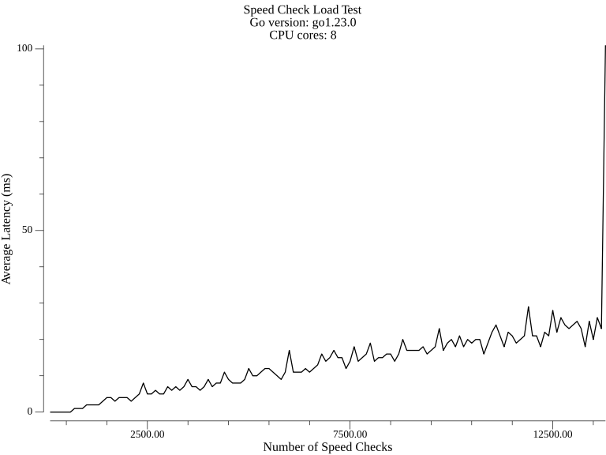

Imagine you're tasked with creating a Traffic Violation Ticket System—one that monitors road traffic, detects speeding violations, and automatically issues tickets. It sounds like a pretty complex job, right? Well, that's exactly what I set out to do with this Go-based project. Not only did we build it, but we also put it through its paces with some serious performance testing.

In this post, I'll walk you through the code that makes this all happen and share some exciting performance results. It's built with efficiency in mind, utilizing multithreading (thanks to Go's goroutines) to handle multiple traffic sensors (cameras) and dispatchers. So buckle up, and let's break it down!

## Key Concepts and Structures

We begin with some definitions. Here's the gist:

- Cameras: These act like speed traps. Each camera is stationed on a specific road and mile marker, and they capture the license plates of passing cars, noting the time and location.
- Dispatchers: These are in charge of receiving tickets and processing them.
- Observations: Every time a car (identified by its license plate) passes a camera, it's logged as an "observation" that contains the car's plate, the timestamp, and the mile marker.
- Tickets: If the system detects speeding between two observations, it issues a ticket, logging details such as the plate, road, speed, and timestamps.

```go title="components.go" frame="code"
type Camera struct {
	road  uint16
	mile  uint16
	limit uint16
}

type Observation struct {
	plate     string
	timestamp uint32
	mile      uint16
}

type Ticket struct {
	plate      string
	road       uint16
	mile1      uint16
	timestamp1 uint32
	mile2      uint16
	timestamp2 uint32
	speed      uint16
}
```

## Handling Incoming Connections: Cameras and Dispatchers
The system listens for incoming TCP connections. The trick here is that each connection can either be from a camera or a dispatcher. The handleConnection function decides who is calling based on the first message they send.

```go title="main.go" frame="code"
for {
	conn, err := l.Accept()
	if err != nil {
		log.Println(err)
		continue
	}
	go handleConnection(conn)
}
```

When a new connection is established, we handle it asynchronously using `goroutines`—Go's lightweight concurrency mechanism. Once a connection is accepted, we determine its role with `MsgIAmCamera` or `MsgIAmDispatcher`.

### Cameras

When a camera connects, we record its details: road number, mile marker, and speed limit. Cameras will later send us plates as they observe cars speeding by.

```go title="handler.go" frame="code"
func handleIAmCamera(conn net.Conn, reader *bufio.Reader) {
	binary.Read(reader, binary.BigEndian, &road)
	binary.Read(reader, binary.BigEndian, &mile)
	binary.Read(reader, binary.BigEndian, &limit)
	
	cameras[conn] = &Camera{road: road, mile: mile, limit: limit}
}
```

### Dispatchers

Dispatchers are responsible for receiving tickets. If a dispatcher connects, we log which roads they are managing and send them any unsent tickets for those roads.

```go title="handler.go" frame="code"
func handleIAmDispatcher(conn net.Conn, reader *bufio.Reader) {
	numroads, _ := reader.ReadByte()
	roads := make([]uint16, numroads)
	for i := 0; i < int(numroads); i++ {
		binary.Read(reader, binary.BigEndian, &roads[i])
	}
	dispatchers[conn] = &Dispatcher{roads: roads}
	sendStoredTickets(road)
}
```

## Spotting Speeding Violations

The heart of the system is detecting when a driver speeds between two cameras. Here's the logic: when a camera observes a car, it logs that car's plate along with the timestamp. If the same plate is observed at another camera, we calculate the speed.


```go title="main.go" frame="code"
func checkSpeed(road uint16, plate string) {
	obs := observations[road][plate]
	sort.Slice(obs, func(i, j int) bool {
		return obs[i].timestamp < obs[j].timestamp
	})
	
	for i := 0; i < len(obs)-1; i++ {
		for j := i + 1; j < len(obs); j++ {
			timeDiff := float64(obs[j].timestamp-obs[i].timestamp) / 3600.0
			distance := float64(abs(int(obs[j].mile) - int(obs[i].mile)))
			speed := distance / timeDiff
			
			if speed > float64(camera.limit)+0.5 {
				ticket := Ticket{
					plate: plate, road: road, mile1: obs[i].mile, timestamp1: obs[i].timestamp,
					mile2: obs[j].mile, timestamp2: obs[j].timestamp, speed: uint16(speed*100 + 0.5),
				}
				storeTicket(road, ticket)
			}
		}
	}
}
```

If the calculated speed exceeds the camera’s speed limit, we create a Ticket. The ticket contains all the evidence: the car’s plate, the timestamps, and the road's details.

## Dispatching Tickets

Once we detect a violation, we try to send the ticket to the appropriate dispatcher responsible for that road. If no dispatcher is available, we store the ticket for later delivery.

```go title="main.go" frame="code"
func sendTicket(road uint16, ticket Ticket) bool {
	for conn, dispatcher := range dispatchers {
		for _, r := range dispatcher.roads {
			if r == road {
				// Send the ticket over the connection
				var buf bytes.Buffer
				buf.WriteByte(MsgTicket)
				// ... (write ticket data)
				conn.Write(buf.Bytes())
				return true
			}
		}
	}
	return false
}
```

## Performance and Scalability

One of the key strengths of our system is its performance under load. We conducted a load test to measure how well it handles increasing numbers of speed checks. The results are impressive:



This graph shows the average latency (in milliseconds) as the number of speed checks increases. Here are some key observations:

1. **Linear Scalability**: The system maintains relatively low latency (under 30ms) for up to about 10,000 speed checks.
2. **Graceful Degradation**: Even as we push past 12,500 speed checks, the latency remains under 100ms, showing that the system degrades gracefully under extreme load.
3. **Efficient Resource Utilization**: The test was run on a system with 8 CPU cores (Go version: go1.23.0), demonstrating efficient use of available resources.

## Final Thoughts


What you might find interesting is that this entire project was inspired by and built to solve Problem 6, titled ["Speed Daemon"](https://protohackers.com/problem/6), from the Protohackers challenge. Protohackers is a series of programming challenges that test your network programming skills, and this particular problem pushed me to create a system that could handle real-world complexities and scale efficiently.

Tackling this Protohackers challenge was not just about writing code; it was about designing a system that could meet specific requirements while maintaining high performance. It's a great example of how coding challenges can help us develop practical skills applicable to real-world scenarios.

Of course, remember that this is a simplified version of what you might encounter in a full production environment. There's a lot more to consider (e.g., retries, fault tolerance, data persistence), but the core functionality is here and ready to catch some virtual speeders!

For those interested in diving deeper into the implementation details, you can find the full code for this project in my GitHub repository: [GitHub Repository](https://github.com/elskow/protohackers-solution/tree/main/6_speed_daemon). Feel free to explore.