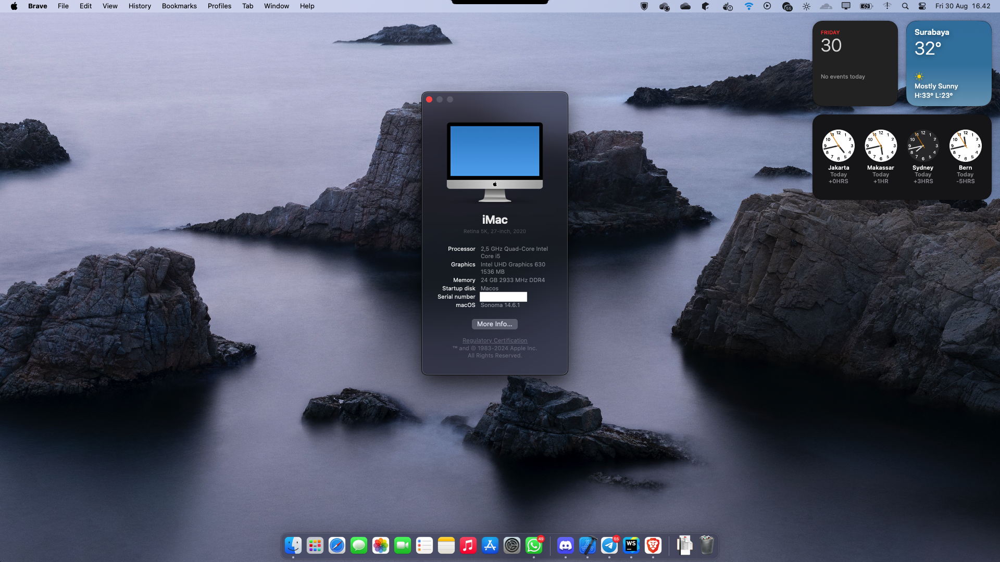

# My uses

I'm a software engineer and I like to use the best tools for the job. Here's a list of the tools I use on a daily basis:

- **Workstation**: Asus TUF Gaming FX505DT
    - **Processor**: Intel i5-10300H
    - **RAM**: 24GB DDR4
    - **Storage**: 512GB NVMe SSD, 1TB HDD
- **Operating System**: Hackintosh (macOS Sonoma), Windows 11
- **Development Tools**:
    - **Editor**: Visual Studio Code
    - **IDE**: JetBrains IDEs (IntelliJ IDEA, PyCharm, WebStorm)
    - **Terminal**: iTerm2 (macOS), Windows Terminal (Windows)
    - **Shell**: Zsh with Oh My Zsh